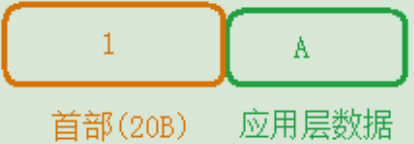
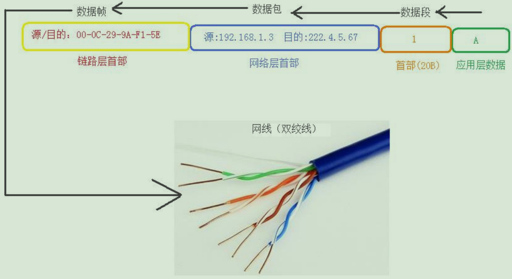
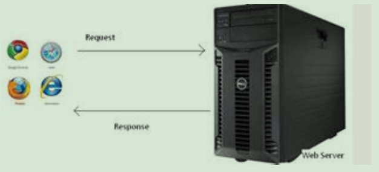

# Windows-网络技术
---

### 1. OSI模型(理论):
+ OSI 模型，即开放式通信系统互联参照模型，是国际化组织（ISO）提出的一个试图使各种计算机在世界范围内可以互联为网络的标准框架，简称 OSI。OSI 把网络协议从逻辑上分为了 7 层。  
  
+ ISO7层网络模型
 	+ 应用层（Application Layer）：提供应用程序之间通信 相当于经理
	+ 表示层（Presentation Layer）：处理数据格式，数据加密 相当于公司中的助理
	+ 会话层（Session Layer）：建立维护和管理会话 相当于公司中的秘书
	+ 传输层（Transport Layer）：建立端对端的连接 相当于公司中的司机
	+ 网络层（Network Layer）：寻址和路由选择 相当于邮局中的排序工人
	+ 数据链路层（Data Link Layer）：介质访问 相当于邮局中的装拆箱工人
	+ 物理层（Physical Layer）:二进制传输 相当于邮局中的搬运工人
	+ 补充基础知识：
	+ 单位换算：
	+ 1Byte=8bit
	+ 1KB=1024Byte（字节）
	+ 1MB=1024KB
	+ 1GB=1024MB
	+ 1TB=1024GB
	+ 1PB=1024TB  
+ 后来演化为: 
   
+ OSI 数据通信原理：
	+ 数据发送端自上而下发送数据（从应用层到物理层），数据层接收端自下而上接收数据（从物理成到应用层）。
	  
+ OSI 对等会话原理：
	+ 数据发送端和数据接收端只有在对等的层次上才可以进行通信，不同层次传输的数据格式不同，数据发送端每经过一层（物理层除外）都要在原数据上进行协议封装，数据接收端每经过一层，都要对原数据进行协议解封装。
+ OSI 模型的记忆法：
	+ All People Seem To Need Data Process
	+ 应用层（Application Layer）：提供应用程序之间通信 相当于经理
	+ 表示层（Presentation Layer）：处理数据格式，数据加密 相当于公司中的助理
	+ 会话层（Session Layer）：建立维护和管理会话 相当于公司中的秘书
	+ 传输层（Transport Layer）：建立端对端的连接 相当于公司中的司机
	+ 网络层（Network Layer）：寻址和路由选择 相当于邮局中的排序工人
	+ 数据链路层（Data Link Layer）：介质访问 相当于邮局中的装拆箱工人
	+ 物理层（Physical Layer）:二进制传输 相当于邮局中的搬运工人

+ OSI 模型的缺点：
	+ 协议实现起来过分复杂，而且运行效率低
	+ 协议指定的周期长，没有及时的进入市场

### 2.TCP/IP模型(实际):
+ TCP/IP 协议是网络中传递信息，管理信息的一些规范。如同人与人相互交流需要遵循一定的规矩，计算机之间的相
互通信也需要共同遵循一定的规则，这些规则就称为网络协议。
+ TCP/IP 协议是网络的基础，可以说没有 TCP/IP 协议就没有互联网的今天。
  

<table>
	<tr><th>层次</th><th>作用</th></tr>
	<tr><td>应用层</td><td>产生数据</td></tr>
	<tr><td>传输层</td><td>拆分要传输的数据（单位：数据段） 添加传输层的首部：源/目的端口号 三次握手</td></tr>
	<tr><td>网络层</td><td>处理数据包（单位：数据包） 添加网络层的首部：源/目的 IP 地址</td></tr>
	<tr><td>网络接口层（链路层）</td><td>在网线上传输信号（单位：数据帧） 添加链路层的首部：源/目的 MAC 地址</td></tr>
	<tr><td>应用层</td><td></td></tr>
	<tr><td>传输层</td><td></td></tr>
	<tr><td>网络层</td><td></td></tr>
	<tr><td>网络接口层</td><td></td></tr>
	<tr><td>应用层</td><td>Web 浏览器和 Web 服务器之间的一问一答的交互过程必须遵循的规则，这个规则就是 HTTP 协议HTTP 是 hypertext transfer protocol（超文本传输协议）的简写，它是 TCP/IP 协议集中的一个应用层协议，用于定义 Web 浏览器和 Web 服务器之间交互数据的过程以及本身的数据格式 <br/ >HTTPS 协议，HTTP 协议安全版本 FTP 协议，文件传输协议 POP3 协议，邮局协议，收邮件用 SMTP 协议，简单邮件传输协议，用来发送电子邮件 TELNET 协议，网络电传协议，远程登录 SSH 协议，用于替代安全性差的 TELNET，用于加密安全登录用 DNS 协议，完成地址查找的工作 DHCP 协议，动态配置 IP 地址 </td> </tr>
	<tr><td>传输层</td><td>TCP(Transmission Control Protocol)协议是一种面向连接的可靠的传输层的控制协议。  UDP 协议，是一个简单的面向数据报的传输层协议。 </td></tr>
	<tr><td>网络层</td><td>IP(Internet Protocol)协议，互联网协议，是用于报文交互的一种面向数据的协议</td></tr>
	<tr><td>网络接口层</td><td>PPP 协议，点对点协议，通常用于创建两个节点之间的连接。</td></tr>

</table>

###3.TCP 和 UDP 区别？

+ TCP 需要建立连接，通过三次握手建立连接，速度稍慢，连接中不限制数据包的大小，安全。
+ UDP 不需要建立连接，速度快，每个数据包限制大小，不安全，有可能丢失文件
+ 在注重速度的时候使用 UDP,如 视频聊天
+ 在注重安全的时候使用 TCP,如 下载文件  

###4.TCP/IP 和 HTTP 区别？
+ TCP/IP 协议主要解决数据在网络中如何传输，而 HTTP 主要解决如何包装数据。在传输数据的过程中，如果只使用
+ TCP/IP 协议，没有应用层协议，便无法识别数据内容，如果要想使传输的数据有意义，必须使用应用层协议，应用
+ 层协议很多，例如 HTTP,FTP,TELNET 等。

###5.三次握手
+ 1. 使用协议 TCP
+ 2. 作用：建立连接（连接成功后传输数据）
+ 3. 过程：
+ TCP 的标志位：
	+ SYN(请求建立连接)
	+ ACK(确认连接)
	+ sequence number（顺序号码）
	+ acknowledge number（确认号码）
	 

+ <b>第一次握手：客户端发送 SYN 包（seq=x）到服务器，并进入 SYN_SEND 状态，等待服务器确认。</b>
+ <b>第二次握手：服务器收到 SYN 包，必须确认收到客户端 SYN 包，向客户端发送确认包 ACK(ack=x+1)，同时服务器自己也发送了一个 SYN 包(seq=y)，即服务器发送了 ACK+SYN 包,此时服务器进入 SYN_RECV 状态。</b>
+ <b>第三次握手：客户端收到服务器 ACK+SYN 包，向服务器发送确认包 ACK(ack=y+1)，此包发送完毕，客户端和服务器进入 ESTABLISHED 状态，完成三次握手.</b>

### 6.IP地址的分类？
+ 为了实现在 INTERNET 上不同计算机之间的通信，每一台计算机必须有一台和其他计算机不重复的地址-IP地址
+ IP 地址是数字型的，32 位（bit），由 4 个 8 位的二进制数组成，每 8 位之间使用圆点隔开。
+ IP 地址被分成了 A B C D E 五类，每个类别的网络标识和主机标识各有规则。
+ IP 地址由网络标识和主机标识组成。

+ IPV4 规定了 IP 地址的长度为 32 位，最大地址个数 2 的 32 次方
+ IPV6 规定了 IP 地址的长度为 128 位，最大地址个数 2 的 128 方

### 7.子网掩码（ subnet mask ）
+ 子网掩码是一个 32 位的二进制数的地址，子网掩码主要是用于判断两个 IP 地址是否在同一个局域网当中，子网掩
+ 码和 IP 地址进行（按位与）运算后，结果一致，表示在同一个局域网当中，结果不一致，表示不在同一个局域网当中。
+ A 类 IP 地址子网掩码：255.0.0.0
+ B 类 IP 地址子网掩码：255.255.0.0
+ C 类 IP 地址子网掩码：255.255.255.0

 

### 8.MAC  地址
+ MAC 地址又称为物理地址，硬件地址，一个主机有一个 MAC 地址，MAC 地址由网卡来决定，是固定的。
+ MAC 地址的长度为 48 位（6 个字节），通常由 12 个 16 进制数来表示 MAC 地址，每 2 个 16 进制数使用冒号隔开。
+ 例如：08:00:20:0A:8C:6D 就是一个 MAC 地址，其中前 6 位代表硬件制造商的编号，后 6 位代表网卡的系列号。
+ 世界上的每个网络设备都有唯一的 MAC 地址。
+ IP 地址和 MAC 地址的区别？
+ IP 地址可变，MAC 地址不可变
+ 长度不同，IP 地址为 32 位，MAC 地址 48 位
+ 协议层不同，IP 地址位于网络层，MAC 地址位于网络接口层 

### 9.常见的端口号:

<table>
	<tr><th>端口号</th><th>服务</th><th>说明</th></tr>
	<tr><td>21</td><td>FTP</td><td>用于上传，下载文件</td></tr>
	<tr><td>23</td><td>TELNET</td><td>远程登录</td></tr>
	<tr><td>25</td><td>SMTP</td><td>发送邮件</td></tr>
	<tr><td>80</td><td>HTTP</td><td>网页浏览</td></tr>
	<tr><td>443</td><td>HTTPS</td><td>提供加密和安全端口传输的另一种 HTTP,网页浏览</td></tr>
	<tr><td>1433</td><td>SQL SERVER </td><td>微软的数据库提供服务的端口</td></tr>
	<tr><td>1521</td><td>ORACLE</td><td>甲骨文的数据库提供服务的端口</td></tr>
	<tr><td>3306</td><td>MYSQL</td><td>甲骨文的数据库提供服务的端口</td></tr>
	<tr><td>8080</td><td>代理端口</td><td>Tomcat 提供服务的端口</td></tr>
	

</table>

### 10.物理设备
+ 1）带宽
	+ 在计算机网络中，网络传输的速率单位（比特每秒），b/s=bit/s=bps(bit per second)
	+ 1M 宽带，理论上下载速度多少？
	+ 1Mb/s 宽带，下载速度多少？
	+ 1Mb/s=1MB/8s=1024KB/8s=128KB/s
	+ 单位换算表：
	+ 1Byte = 8bit
	+ 1KB = 1024Byte(字节) = 8*1024bit
	+ 1MB = 1024KB
	+ 1GB = 1024MB
	+ 1TB = 1024GB
	+ 1PB = 1024TB

+ 2)ADSL(非对称数字用户线路)
	+ ADSL 技术把普通的电话线分成了电话，上行，下行三个相对独立的信道，从而避免了相互之间的干扰。是一种新的
	+ 数据的传输方式。
	+ 调制解调器（MODEM）,猫，它的作用是模拟信号和数字信号的“翻译官”，它可以把计算机的数字信号翻译成可沿
	+ 电话线传输的模拟信号，而这些模拟信号可以被另一端的另一个调制解调器接收，并翻译成计算机可以懂的语言。
	+ 这个简单的过程完成了计算机之间的通信。

+ 2)路由器（Router）
	+ 路由器是一种负责寻径的网络设备，路由器在互联网络中从多条路径中寻找通讯量最少的一条的网络路径提供给用
	+ 户通信，路由器是不同网络的主机通讯需要的设备，路由器是用来不同网段之间通信的。
+ 3）网关（Gateway）
	+ 网关是一个网络连接到另一个网络的“关口”
+ 4）交换机（Switch）
	+ 交换机是同一网络内主机通信需要的设备，交换机是用来同网段之间通信的。

